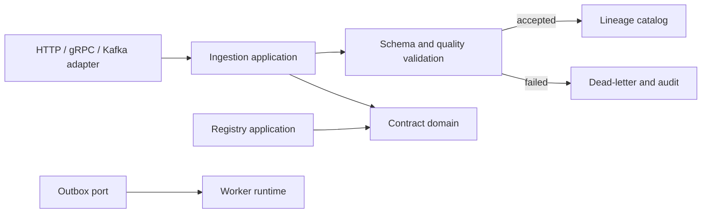

# Event Contract Quality Gateway

Event Contract Quality Gateway is a Go 1.23 service for registering typed event
contracts and validating producer traffic before it reaches a stream. The
default development mode uses an in-memory repository; its domain and
application ports are intentionally separate from HTTP and can be backed by
PostgreSQL, Kafka, and object storage adapters.

## Implemented flows

- Register a tenant-scoped contract and schema versions with deterministic
  canonical fingerprints.
- Check JSON-schema-like and Protobuf-descriptor-like field models for removed
  fields, narrowing types/enums, required fields, defaults, and annotations.
- Publish a version with optimistic `If-Match` concurrency protection.
- Receive an event through `POST /api/v1/ingest/events`, enforce tenant quota,
  idempotency key, timestamp window, published schema, mandatory fields, HMAC,
  and bounded declarative quality rules.
- Preserve processing attempts and lineage. Validation failures become audited,
  partitionable dead letters with bounded manual replay.
- Provide health, readiness, metrics, pprof, JSON errors, graceful shutdown,
  a worker entrypoint, OpenAPI and proto contracts.

Operational query and quality endpoints are also available:

- `GET /api/v1/events?contract_id=...&status=accepted&limit=50&cursor=...`
  provides deterministic cursor pagination with partition, text and time
  filters.
- `GET /api/v1/events/{id}` returns the original payload, receipt and attempts;
  `GET /api/v1/events/summary?contract_id=...` returns acceptance, dead-letter,
  duplicate and latency aggregates.
- `GET /api/v1/contracts/{id}/quality-rules` lists configured rules and
  `GET /api/v1/events/{id}/quality-results/detailed` includes per-rule timing
  and failure codes.
- Rule policies are versioned in memory; use
  `POST /api/v1/contracts/{id}/quality-rules/{version}/activate` to roll back
  or promote a validated policy version.
- `GET /api/v1/dead-letters?state=pending` filters the queue. Batch replay is
  available through `POST /api/v1/dead-letters/replay` with a `letter_ids`
  array and optional actor; each item reports an independent result.

Payload validation checks required fields, primitive types and enum membership
before quality rules execute. Rule results are sorted by rule ID for stable
audit output, and event responses deep-copy payload maps so API consumers
cannot mutate gateway state.

## Start

```sh
cp .env.example .env
go run ./cmd/gateway
curl -H 'X-Tenant-ID: acme' http://localhost:8080/healthz
```

No database is necessary for the default verification path. The process keeps
metadata only for its lifetime. Production persistence ports and migrations
are supplied as a deployment contract; wire a durable adapter before using it
for retained audit data.

## API example

```sh
curl -X POST http://localhost:8080/api/v1/contracts \
  -H 'Content-Type: application/json' -H 'X-Tenant-ID: acme' \
  -d '{"name":"billing.invoice.created","compatibility":"backward"}'
```

Create a version using the returned contract id, then publish it with the
version `etag` returned by the create-version response. Events require
`X-Tenant-ID` and `Idempotency-Key` headers.

## Design



The domain layer is transport and storage independent. A contract starts as a
draft version; its permitted lifecycle is `draft -> published -> deprecated ->
retired`. Events have a separate `accepted | dead_lettered` processing result.
Dead letters move `pending -> replaying -> replayed`, or become `poisoned`
when their replay budget has been exhausted.

## Safety and operations

The rule language is intentionally declarative (`required`, `equals`, `regex`,
`min`, `max`) and evaluates no user-provided program. Request body size,
timestamp age, rule compilation, tenant quota and replay counts are bounded.
The service only logs structural operational information. Do not place payloads
or HMAC keys in logs. `docs/` contains the full data dictionary, threat model,
capacity estimate and incident exercises.

## Validation

```sh
make fmt vet test build smoke stop count
```

The smoke script starts a temporary gateway, executes contract publish and
ingestion paths, then stops it. It needs Go 1.23+. The project directory must
be initialized with `git init` before committing changes.
